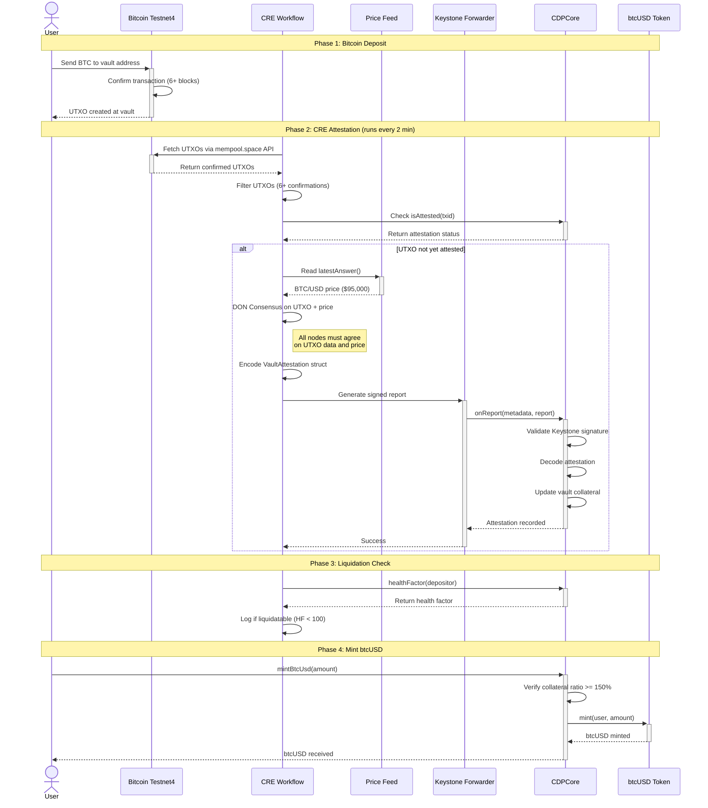

# btcUSD — Bitcoin-Backed Stablecoin with Chainlink CRE

**Trustless Bitcoin-Collateralized Stablecoin using Chainlink's Decentralized Oracle Network**

[](https://opensource.org/licenses/MIT)
[](https://www.typescriptlang.org/)
[](https://soliditylang.org/)

## Overview

btcUSD enables users to deposit Bitcoin on the Bitcoin network and mint USD-pegged stablecoins on EVM chains. The system uses **Chainlink CRE** (Chainlink Runtime Environment) for trustless Bitcoin deposit verification, **Chainlink Price Feeds** for real-time BTC/USD pricing, and is **CCIP-ready** for cross-chain bridging.

### Key Features

- **Bitcoin Collateral**: Deposit BTC on Bitcoin Testnet4 to mint stablecoins on EVM
- **Chainlink CRE Attestation**: DON consensus verifies Bitcoin UTXOs exist
- **Real-time Pricing**: Chainlink BTC/USD Price Feed for accurate collateral valuation
- **CDP Mechanics**: 150% minimum collateral ratio with liquidation support
- **Liquidation Detection**: Workflow monitors vault health and flags undercollateralized positions
- **CCIP Ready**: `IBurnMintERC20` interface for burn-and-mint cross-chain bridging
- **Fully On-Chain**: All CDP state managed transparently on Base Sepolia

## Architecture

```
┌─────────────────────────────────────────────────────────────────────────────┐
│                           btcUSD System Architecture                         │
└─────────────────────────────────────────────────────────────────────────────┘

┌─────────────────┐                                    ┌─────────────────┐
│     User        │                                    │   Base Sepolia  │
│                 │                                    │                 │
│  1. Deposit BTC │                                    │  5. Mint btcUSD │
│     to vault    │                                    │     to user     │
└────────┬────────┘                                    └────────▲────────┘
         │                                                      │
         ▼                                                      │
┌─────────────────┐     ┌─────────────────┐     ┌─────────────────┐
│   Bitcoin       │     │  Chainlink CRE  │     │    CDPCore      │
│   Testnet4      │────▶│  Workflow       │────▶│    Contract     │
│                 │     │                 │     │                 │
│  tb1q0key5k...  │     │ 2. Fetch UTXOs  │     │ 4. Receive      │
│  (vault addr)   │     │ 3. DON Consensus│     │    attestation  │
└─────────────────┘     │    + Price Feed │     │    via Keystone │
                        └─────────────────┘     └─────────────────┘
                                │
                                ▼
                        ┌─────────────────┐
                        │ Chainlink Price │
                        │ Feed (BTC/USD)  │
                        │                 │
                        │ $95,000/BTC     │
                        └─────────────────┘
```

## Complete Message Flow

### Sequence Diagram



### Phase-by-Phase Breakdown

#### Phase 1: Bitcoin Deposit (~60 minutes)
- User sends BTC to the monitored vault address on Bitcoin Testnet4
- Transaction is broadcast and included in a block
- Wait for 6 confirmations (~60 minutes) for finality

#### Phase 2: CRE Attestation (~2 minutes)
- Workflow triggers on cron schedule (every 2 minutes)
- Fetches all UTXOs for vault address from mempool.space
- Filters for 6+ confirmations
- Checks CDPCore to skip already-attested UTXOs
- Reads BTC/USD price from Chainlink Price Feed
- DON reaches consensus on the data
- Submits signed attestation to CDPCore via Keystone Forwarder

#### Phase 3: Liquidation Check (~1 second)
- After attestation, workflow reads vault health factor
- Logs warning if position is undercollateralized
- Enables external liquidation bots to monitor

#### Phase 4: Minting (~15 seconds)
- User calls `mintBtcUsd()` with desired amount
- Contract verifies collateral ratio >= 150%
- btcUSD tokens minted to user's address

**Total Time**: ~65 minutes (Bitcoin confirmation dominates)

## Chainlink Integration

This project uses **three Chainlink services**:

| Service | Purpose | Implementation |
|---------|---------|----------------|
| **Chainlink CRE** | Bitcoin UTXO attestation workflow | [`btcusd-workflow/main.ts`](btcusd-workflow/main.ts) |
| **Chainlink Price Feeds** | Real-time BTC/USD oracle | [`main.ts:170-199`](btcusd-workflow/main.ts#L170-L199) |
| **Chainlink CCIP** | Cross-chain btcUSD bridging | [`btcUSD.sol`](contracts/src/btcUSD.sol) |

### Files Using Chainlink

| File | Chainlink Usage |
|------|-----------------|
| [`btcusd-workflow/main.ts`](btcusd-workflow/main.ts) | CRE workflow, HTTPClient, EVMClient, consensusIdenticalAggregation, Price Feed read, liquidation monitoring |
| [`btcusd-workflow/contracts/abi/PriceFeedAggregator.ts`](btcusd-workflow/contracts/abi/PriceFeedAggregator.ts) | Chainlink Price Feed ABI (latestAnswer) |
| [`contracts/src/btcUSD.sol`](contracts/src/btcUSD.sol) | IBurnMintERC20 interface for CCIP TokenPool compatibility |
| [`contracts/src/CDPCore.sol`](contracts/src/CDPCore.sol) | Receives CRE attestations via Keystone Forwarder, ILogAutomation interface |
| [`contracts/script/ConfigureCDPCore.s.sol`](contracts/script/ConfigureCDPCore.s.sol) | Configures Keystone Forwarder and workflow owner addresses |
| [`contracts/script/CCIPBridgeDemo.s.sol`](contracts/script/CCIPBridgeDemo.s.sol) | CCIP burn-and-mint bridging demonstration |

### CRE Workflow Capabilities Used

```typescript
// HTTP Client - fetches Bitcoin UTXOs from mempool.space
const httpClient = new cre.capabilities.HTTPClient()
httpClient.sendRequest(runtime, fetchUTXOsForConsensus, consensusIdenticalAggregation<string>())

// EVM Client - reads price feed and contract state
const evmClient = new cre.capabilities.EVMClient(chainSelector)
evmClient.callContract(runtime, { call: encodeCallMsg(...) })

// Report Generation - DON-signed attestations
runtime.report({ encodedPayload, encoderName: 'evm', signingAlgo: 'ecdsa' })

// Report Submission - via Keystone Forwarder
evmClient.writeReport(runtime, { receiver: cdpCoreAddress, report })
```

## Protocol Encoding

### VaultAttestation Structure

The CRE workflow encodes attestations using this ABI structure:

```solidity
struct VaultAttestation {
    bytes32 txid;        // Bitcoin transaction ID (reversed byte order)
    uint64 amountSat;    // Amount in satoshis
    uint32 blockHeight;  // Bitcoin block height
    uint256 btcPriceUsd; // BTC/USD price (8 decimals)
    uint256 timestamp;   // Unix timestamp
    address depositor;   // EVM address of depositor
}
```

### Example Encoded Report

```
0x                                                              // Report data
a151a8be4c687caa0a3c6ca0bb0c0c22a103f3e04b7f4ca2582ed3692ba1ffb9  // txid (bytes32)
000000000000c350                                                // amountSat (50,000 sats)
00019dd6                                                        // blockHeight (105,942)
0000000000000000000000000000000000000000000000000008a8e4b80e40    // btcPriceUsd ($95,000)
0000000000000000000000000000000000000000000000000000000065f5c8a0  // timestamp
0000000000000000000000008966cacc8e138ed0a03af3aa4aee7b79118c420e  // depositor
```

### CDP Mechanics

| Parameter | Value | Description |
|-----------|-------|-------------|
| **MCR** | 150% | Minimum Collateral Ratio |
| **Liquidation Threshold** | 100 | Health factor below which vault is liquidatable |
| **Price Staleness** | 15 minutes | Maximum age of price data |
| **Confirmations** | 6 | Required Bitcoin confirmations |
| **Cron Schedule** | Every 2 min | Workflow execution frequency |

### Health Factor Calculation

```
Health Factor = (Collateral Value in USD) / (Debt * MCR)

Example:
- Collateral: 100,000 sats = 0.001 BTC
- BTC Price: $95,000
- Collateral Value: $95
- Debt: 50 btcUSD
- MCR: 150% = 1.5

Health Factor = $95 / ($50 * 1.5) = $95 / $75 = 126.67

If Health Factor < 100 → Position is liquidatable
```

## Deployed Contracts (Base Sepolia)

| Contract | Address | Explorer |
|----------|---------|----------|
| **BtcUSD** | `0xA5FCD5d200f949F7e78D4c7771F602aa4B0e387A` | [View](https://sepolia.basescan.org/address/0xA5FCD5d200f949F7e78D4c7771F602aa4B0e387A) |
| **CDPCore** | `0x4F545CE997b7A5fEA9101053596D4834Bc882c7f` | [View](https://sepolia.basescan.org/address/0x4F545CE997b7A5fEA9101053596D4834Bc882c7f) |

### Configuration

| Setting | Value |
|---------|-------|
| **Vault Address** | `tb1q0key5kvy054ke6xt0aaj4k0gwk2jyuhu3h2jfy` |
| **Keystone Forwarder** | `0x82300bd7c3958625581cc2F77bC6464dcEcDF3e5` |
| **Workflow Owner** | `0x8966caCc8E138ed0a03aF3Aa4AEe7B79118C420E` |
| **BTC/USD Feed** | Chainlink Base Sepolia |
| **Chain Selector** | `10344971235874465080` (Base Sepolia) |

### CCIP Configuration (Ready for Bridging)

| Chain | Selector | Router |
|-------|----------|--------|
| **Base Sepolia** | `10344971235874465080` | CCIP Router |
| **Arbitrum Sepolia** | `3478487238524512106` | `0x2a9C5afB0d0e4BAb2BCdaE109EC4b0c4Be15a165` |

## Quick Start

### Prerequisites

- [CRE CLI](https://docs.chain.link/cre) - Chainlink Runtime Environment CLI
- [Foundry](https://book.getfoundry.sh/) - Solidity development toolkit
- [Bun](https://bun.sh/) - JavaScript runtime

### Installation

```bash
# Clone the repository
git clone https://github.com/FrankiePower/bitcoin-backed.git
cd bitcoin-backed

# Install workflow dependencies
bun install --cwd ./btcusd-workflow

# Install contract dependencies
cd contracts && forge install && cd ..
```

### Configuration

Create a `.env` file in the contracts directory:

```env
# Your private key (with funds on Base Sepolia)
CRE_ETH_PRIVATE_KEY=0x<your-private-key>

# RPC URLs
BASE_SEPOLIA_RPC=https://base-sepolia-rpc.publicnode.com
```

### Run Simulation

```bash
# Simulate the CRE workflow
cre workflow simulate ./btcusd-workflow --target staging-settings
```

Expected output:
```
Initializing...
Compiling workflow...
✓ Workflow compiled
[USER LOG] === btcUSD Bitcoin Attestation Workflow ===
[USER LOG] Vault address: tb1q0key5kvy054ke6xt0aaj4k0gwk2jyuhu3h2jfy
[USER LOG] Found 2 confirmed UTXOs with 6+ confirmations
[USER LOG] BTC/USD price from Chainlink: 9500000000000 (8 decimals)
[USER LOG] === Checking Vault Health ===
[USER LOG] Health Factor: 12666666666666666666
[USER LOG] ✓ Vault is healthy (above 150% MCR)
```

### Run Demo (End-to-End)

```bash
cd contracts

# Set environment
export CRE_ETH_PRIVATE_KEY="0x<your-private-key>"

# Run demo flow (simulates attestation + mints btcUSD)
forge script script/DemoFlow.s.sol:DemoFlowScript \
  --rpc-url https://base-sepolia-rpc.publicnode.com \
  --broadcast
```

Expected output:
```
=== btcUSD Demo Flow ===
User: 0x8966caCc8E138ed0a03aF3Aa4AEe7B79118C420E
Attested UTXO 1: 50,000 sats
Attested UTXO 2: 50,000 sats
Total collateral: 100000 sats
Minted: 60 btcUSD
btcUSD balance: 60
Health factor: 158333333333333333333
=== Demo Complete ===
```

### Run CCIP Bridge Demo

```bash
cd contracts

# Demonstrates btcUSD burn-and-mint CCIP capability
forge script script/CCIPBridgeDemo.s.sol:CCIPBridgeDemo \
  --rpc-url https://base-sepolia-rpc.publicnode.com \
  --broadcast
```

## Smart Contracts

### btcUSD Token

ERC20 stablecoin with CCIP burn-and-mint support:

```solidity
contract BtcUSD is ERC20, ERC20Burnable, Ownable, IERC165 {
    // Minter/Burner roles for CDPCore and CCIP TokenPools
    mapping(address => bool) private _minters;
    mapping(address => bool) private _burners;

    // CCIP TokenPool compatibility
    function mint(address account, uint256 amount) external onlyMinter;
    function burnFrom(address account, uint256 amount) public override onlyBurner;

    // ERC165 for CCIP detection
    function supportsInterface(bytes4 interfaceId) public pure override returns (bool);
}
```

### CDPCore

CDP (Collateralized Debt Position) manager receiving CRE attestations:

```solidity
contract CDPCore {
    struct Vault {
        uint256 collateralSat;    // Total BTC collateral in satoshis
        uint256 debtBtcUsd;       // Total btcUSD debt
        uint256 lastPriceUsd;     // Last attested BTC price
        uint256 lastUpdate;       // Timestamp of last attestation
        bytes32[] attestedTxids;  // List of attested Bitcoin txids
    }

    // Receive CRE attestations via Keystone Forwarder
    function onReport(bytes calldata metadata, bytes calldata report) external;

    // Mint btcUSD against collateral
    function mintBtcUsd(uint256 amount) external;

    // Repay debt and withdraw collateral
    function repayAndWithdraw(uint256 repayAmount) external;

    // Liquidate undercollateralized positions
    function liquidate(address user) external;

    // View functions
    function healthFactor(address user) external view returns (uint256);
    function getVault(address user) external view returns (Vault memory);
}
```

## Security Model & Limitations

### Current Implementation (v1 - Hackathon Demo)

| Aspect | Status | Notes |
|--------|--------|-------|
| Bitcoin attestation | ✅ Working | CRE verifies UTXOs exist via mempool.space |
| Price oracle | ✅ Working | Chainlink BTC/USD feed (8 decimals) |
| CDP mechanics | ✅ Working | 150% MCR, mint/repay/liquidate |
| Liquidation detection | ✅ Working | Workflow monitors vault health factor |
| CCIP bridging | ✅ Ready | IBurnMintERC20 interface implemented |
| DON consensus | ✅ Working | consensusIdenticalAggregation on UTXOs |
| **BTC custody enforcement** | ⚠️ **Not implemented** | See below |

### Important Limitation

**This is a proof-of-concept.** The current design attests that BTC exists at a vault address but does NOT enforce custody:

```
Current Model (Trusted):
1. User deposits BTC to vault address
2. CRE attests the UTXO exists
3. User mints btcUSD
4. ⚠️ User could move BTC (no on-chain enforcement)

Production Model (Trustless):
1. User deposits BTC to P2WSH script with spending conditions
2. CRE attests the locked UTXO
3. User mints btcUSD
4. ✅ BTC can only be unlocked when debt is repaid (enforced by Bitcoin script)
```

### Production Roadmap (v2)

For trustless BTC custody, future versions would implement:

| Feature | Description | Complexity |
|---------|-------------|------------|
| **DLC-based locking** | BTC locked in 2-of-2 multisig with oracle-signed spending conditions | High |
| **UTXO monitoring** | CRE detects if collateral UTXOs are spent, triggers liquidation | Medium |
| **P2WSH scripts** | Bitcoin-native spending conditions tied to EVM debt state | High |
| **BitVM verification** | ZK-proof based custody verification | Very High |

## Performance & Costs

### Timing Breakdown

| Phase | Duration | Notes |
|-------|----------|-------|
| Bitcoin deposit | Variable | User action |
| Block confirmation | ~60 minutes | 6 confirmations |
| CRE workflow | ~2 minutes | Cron interval |
| Attestation submission | ~15 seconds | EVM transaction |
| Minting btcUSD | ~15 seconds | EVM transaction |
| **Total (deposit to mint)** | **~65 minutes** | Bitcoin finality dominates |

### Gas Costs (Base Sepolia)

| Operation | Estimated Gas | Cost at 0.001 gwei |
|-----------|--------------|-------------------|
| `onReport()` | ~150,000 | ~0.00015 ETH |
| `mintBtcUsd()` | ~80,000 | ~0.00008 ETH |
| `repayAndWithdraw()` | ~100,000 | ~0.0001 ETH |
| `liquidate()` | ~120,000 | ~0.00012 ETH |

## Comparison with Other Bitcoin-Backed Stablecoins

| Feature | btcUSD | eBTC (Badger) | DLLR (Sovryn) | USDe (Ethena) |
|---------|--------|---------------|---------------|---------------|
| **Collateral** | Native BTC | stETH (not BTC) | BTC (RSK) | ETH derivatives |
| **Oracle** | Chainlink CRE | Chainlink | Custom | Multiple |
| **Chain** | Any EVM (via CCIP) | Ethereum | RSK only | Ethereum |
| **Min Collateral** | 150% | 110% | 110% | Variable |
| **Custody** | Attestation (v1) | Smart contract | Federated | Custodial |
| **Cross-chain** | CCIP ready | No | No | No |

## Project Structure

```
bitcoin-backed/
├── btcusd-workflow/              # CRE workflow
│   ├── main.ts                   # Bitcoin attestation + liquidation monitoring
│   ├── config.json               # Vault address, chain config
│   └── contracts/abi/            # CDPCore, PriceFeed ABIs
├── contracts/                    # Solidity contracts
│   ├── src/
│   │   ├── btcUSD.sol            # ERC20 + CCIP compatible token
│   │   └── CDPCore.sol           # CDP logic + CRE receiver
│   └── script/
│       ├── Deploy.s.sol          # Deployment script
│       ├── ConfigureCDPCore.s.sol # Keystone Forwarder setup
│       ├── DemoFlow.s.sol        # End-to-end demo
│       └── CCIPBridgeDemo.s.sol  # CCIP bridging demo
├── project.yaml                  # CRE project config
└── README.md                     # This file
```

## Roadmap

- [x] Core CRE workflow implementation
- [x] Bitcoin UTXO attestation via mempool.space
- [x] Chainlink Price Feed integration
- [x] CDPCore contract with mint/repay/liquidate
- [x] btcUSD ERC20 with CCIP compatibility
- [x] Liquidation detection in workflow
- [x] CCIP bridge demo
- [ ] Production deployment on mainnet
- [ ] Multi-depositor support
- [ ] P2WSH custody enforcement
- [ ] DLC integration for trustless locking
- [ ] CCIP TokenPool registration
- [ ] Governance token

## Testing

```bash
# Run CRE workflow simulation
cre workflow simulate ./btcusd-workflow --target staging-settings

# Run Solidity tests
cd contracts
forge test

# Run with verbosity
forge test -vvv
```

## References

- [Chainlink CRE Documentation](https://docs.chain.link/cre)
- [Chainlink Price Feeds](https://docs.chain.link/data-feeds)
- [Chainlink CCIP](https://docs.chain.link/ccip)
- [DLC Specifications](https://github.com/discreetlogcontracts/dlcspecs) - Future custody model
- [mempool.space API](https://mempool.space/docs/api) - Bitcoin UTXO data

## Contributing

Contributions are welcome! Please:

1. Fork the repository
2. Create a feature branch (`git checkout -b feature/amazing-feature`)
3. Commit your changes (`git commit -m 'Add amazing feature'`)
4. Push to the branch (`git push origin feature/amazing-feature`)
5. Open a Pull Request

## License

This project is licensed under the MIT License - see the [LICENSE](LICENSE) file for details.

## Acknowledgments

- **Chainlink** for CRE, Price Feeds, and CCIP infrastructure
- **mempool.space** for Bitcoin Testnet4 API
- **Base** for EVM execution environment
- **Foundry** for Solidity development toolkit

---

**Built for ETHGlobal Buenos Aires Hackathon - DeFi & Tokenization Track**
